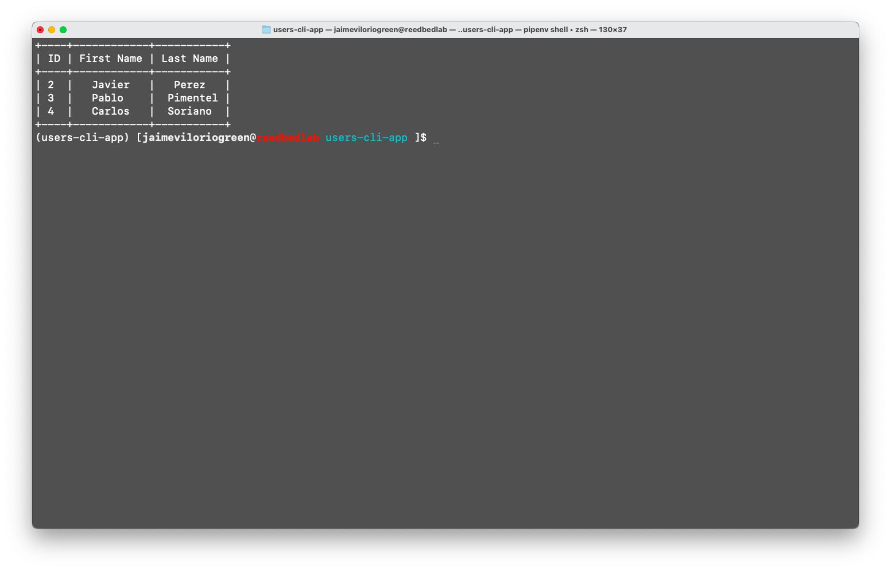

# User Managment CLI Apps



This application was developed following the tutorial of [Fazt Code](https://www.youtube.com/watch?v=4zenT23rZFM).

## Installation
In my case, am using [pipenv](https://pipenv.pypa.io/en/latest/) as virtualenv managment, so you should run:

- `pipenv install -r requirements.txt`
- `pipenv shell`

## Bash Script
To shorten and automate the command execution process, create a bash script file (name app.sh), in the root folder, with the following command.

```bash
#! /bin/zsh

python src/app.py $@

```
In my case, my shell is `zsh`, change for yours.

## Commands

- `./app.sh` → Run the application.
- `./app.sh --help` → Show help (options, command and argument that need de app).
- `./app.sh new --help` → Show options of the command new.
- `./app.sh new` → Create a new user.
  - `--fname [first name] --lname [lastname]`
- `./app.sh users` → Show all users.
- `./app.sh user [id]` → Show one user by id.
- `./app.sh delete [id]` → Delete one user by id.
- `./app.sh update [id]` → Update one user by id.
  - `--fname [first name] --lname [lastname]`


